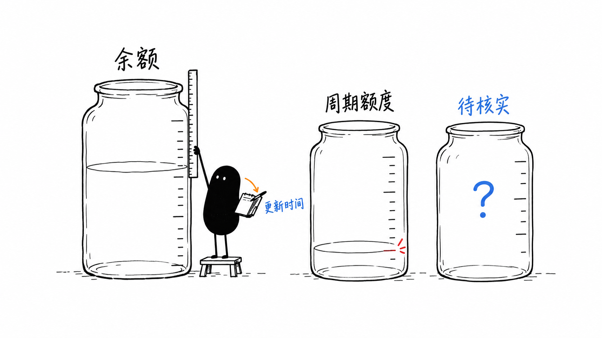

# 上游账户监控配图



小黑分别量取独立罐子的读数并记录更新时间。用于解释余额、周期额度和未知值分别展示，不合并不同单位，也不把未知当作零。

本图作为 README 和中文使用指南的主配图。风格来自 Ian 小黑配图 Skill：白底黑色手绘、少量红橙蓝标注，小黑承担画面的核心动作。

## 生成记录

- 日期：2026-10-01。
- 通道：用户指定的 CPA Images API，使用 ImageGen Skill 的 CLI fallback。
- 请求模型：`gpt-image-2`；质量：`high`；请求尺寸：`1536x864`。
- 实际原始输出：`1672x941` PNG，约 16:9；保留上游返回的原始尺寸，未裁剪或拉伸。
- 图内标注：余额、周期额度、待核实、更新时间。
- 完整提示词：[01-account-watch.txt](./prompts/01-account-watch.txt)。
- 检查：主体动作、单一隐喻、白底留白、中文可读性、颜色用途和无标题均已人工核对。

## 复用提示词

先在本地配置自己的 `OPENAI_API_KEY` 与 CPA 的 `OPENAI_BASE_URL`（包含 `/v1`），不要把凭据写入仓库。将 `IMAGE_GEN` 指向已安装 ImageGen Skill 的 `scripts/image_gen.py`，并准备其 Python 依赖。在本仓库根目录运行：

```sh
python "$IMAGE_GEN" generate \\
  --prompt-file assets/upstream-monitor-illustrations/prompts/01-account-watch.txt \\
  --model gpt-image-2 --size 1536x864 --quality high --no-augment \\
  --out output/imagegen/01-account-watch-v2.png
```

新的生成结果另存为版本文件，检查后再决定是否替换当前配图。上游返回的尺寸可能与请求尺寸不同。
